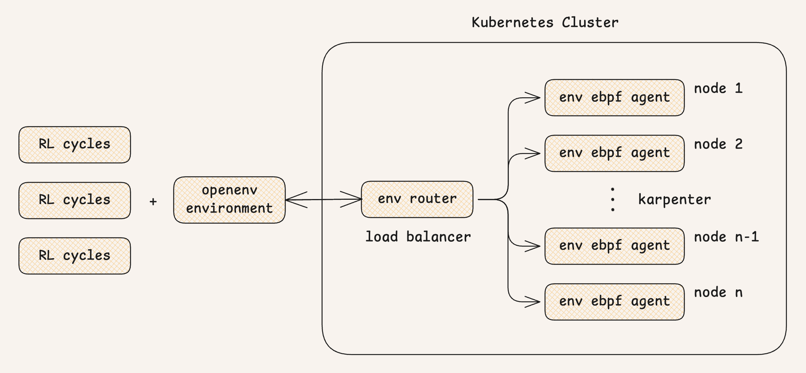
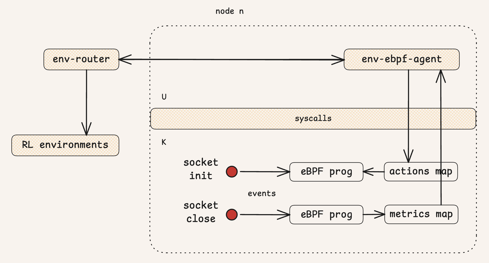

# Socket Tuner: Kernel-Level Network Optimization

Socket Tuner is an RL gym for optimizing the Linux TCP stack using privileged eBPF agents. Hosted on EKS, it allows for real-time interception and tuning of socket parameters for specific network workloads.

## Motivation

Networking is a major pillar of modern containerized workloads and microservices, where efficient communication with object storage is critical. While default kernel parameters are optimized for general use, specialized tuning can unlock up to **20x faster performance** for extreme cases. 

Rather than using system-wide `sysctl` settings that risk degrading other applications, Socket Tuner leverages **eBPF-based dynamic socket tuning** to apply the perfect configuration for every connection individually.

## Previous Work

This project builds upon foundational research in eBPF-based network orchestration. Most notably, the work on **[NetEdit: An Orchestration Platform for eBPF Network Functions at Scale](https://dl.acm.org/doi/epdf/10.1145/3651890.3672227)** by folks at Meta and CMU laid the groundwork for leveraging eBPF for socket modification and large-scale network function capabilities.

## Architecture & Workflow

The system uses an **Environment Router** (Load Balancer) to manage a pool of worker nodes. Each node runs an **Environment Agent** for workload execution and a privileged **eBPF Agent** for kernel-level socket interception and monitoring.



1.  **Reset**: Selects a task (e.g., S3 download, GitHub clone) and establishes a non-tuned baseline.
2.  **Step**: Applies a **Tuning Action** to the eBPF map for the destination IP, re-runs the task, and returns performance-based rewards.

## eBPF Agent Implementation

The eBPF Agent provides deep kernel observability and real-time tuning capabilities by intercepting socket lifecycle events. It uses specialized `sock_ops` and `TCP` hooks to collect high-fidelity metrics and apply parameters.



## Tuning & Observability

Optimization leverages kernel-level trade-offs to achieve peak networking performance for specialized workloads.

| Category | Parameters / Metrics |
| :--- | :--- |
| **Tuning Controls** | `cong_algo` (cubic/bbr), `init_cwnd`, `window_clamp`, `no_delay` |
| **Performance Metrics** | SRTT (Latency), MDEV (Jitter), Retransmissions (Loss), Total Duration |

## Project Organization

The project is structured into several core components:

- **Root Directory**: Contains project-wide configuration (`pyproject.toml`, `openenv.yaml`), the Inference Engine (`inference.py`), and the client interface (`client.py`).
- **`env-ebpf-agent/`**: The Go-based privileged agent responsible for loading and managing the eBPF programs. Contains the eBPF source code in C (`socket_tuner.c`).
- **`env-router/`**: The orchestrator (Go) that manages the lifecycle of environment agents and routes requests to available worker nodes in the cluster.
- **`server/`**: The Python-based OpenEnv environment server, implementing the core gym logic and providing FastAPI/WebSocket endpoints.
- **`kubernetes-cluster/`**: Infrastructure as Code (IaC) and manifest files for deploying the system to EKS, including Karpenter and AWS ALB configuration.

## Quick Start

### Building the Environment

To build the Docker image for the environment:

```bash
docker build -t socket-tuner:latest .
```

### Using the Client

You can interact with the environment using the `SocketTunerEnv` client:

```python
from socket_tuner import SocketTunerAction, SocketTunerEnv

# Create or connect to the environment
with SocketTunerEnv(base_url="http://localhost:8000") as env:
    # Reset to start a new episode
    result = env.reset()
    
    # Apply a tuning action
    # For available parameters, see models.py
    action = SocketTunerAction(
        message="Optimize connection settings"
    )
    result = env.step(action)
    print(f"Reward: {result.reward}")
```

For more details on the API and models, see [models.py](file:///Users/4rivappa/personal/socket-tuner/models.py).
